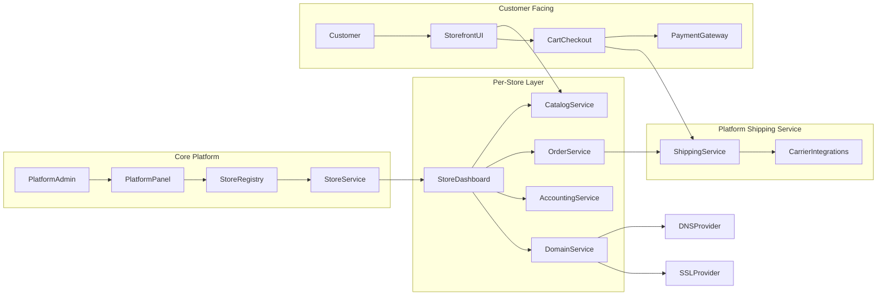

این دو تا PRD رو ترکیب کن، و یک PRD تحویل بده

سند نیازمندی‌های محصول (PRD): پلتفرم UltraShop

نسخه: ۱.۰ | وضعیت: در حال تدوین | هدف: هوشمندسازی کامل فرآیند ساخت و مدیریت فروشگاه اینترنتی
۱. خلاصه مدیریتی (Executive Summary)

UltraShop یک پلتفرم فروشگاه‌ساز نسل جدید (SaaS) است که به جای ابزارهای سنتی، از AI Agents برای مدیریت چرخه حیات یک کسب‌وکار آنلاین استفاده می‌کند. هدف این است که کاربر بدون دانش فنی، تنها با گفتگو و آپلود عکس، فروشگاهی حرفه‌ای، سئو شده و دارای سیستم مالی دقیق داشته باشد.
۲. مخاطبان هدف

    خرده‌فروشان سنتی که قصد ورود به بازار آنلاین را دارند.

    تولیدکنندگان محتوا و اینفلوئنسرها.

    کسب‌وکارهای متوسط که نیاز به مدیریت چندین انبار و حسابداری یکپارچه دارند.

۳. ویژگی‌های کلیدی (Functional Requirements)
الف) معمار هوشمند (AI Onboarding & Builder)

    Setup Wizard: دریافت نام، حوزه فعالیت و سلیقه بصری از طریق چت.

    Branding AI: تولید خودکار لوگو، پالت رنگی و انتخاب فونت سازگار با برند.

    Drag-and-Drop Editor: امکان ویرایش چیدمان صفحه اصلی با بلوک‌های آماده، تحت نظارت ایجنت بهینه‌ساز نرخ تبدیل (CRO).

ب) استودیو محتوای هوشمند (AI Content & SEO Engine)

    Vision-to-Listing: استخراج ویژگی‌های محصول از روی عکس (نام، جنس، رنگ).

    SEO Automator: تولید تگ‌های متا، توضیحات محصول (Copywriting) و متن جایگزین تصاویر (Alt Text).

    Content Calendar: پیشنهاد خودکار زمان‌بندی برای تخفیف‌ها و کمپین‌ها.

ج) مدیریت انبار و لجستیک (Multi-Warehouse)

    انبارداری چندگانه: تعریف انبارهای مختلف و تخصیص موجودی به هر کدام.

    Smart Routing: انتخاب خودکار نزدیک‌ترین انبار به مشتری برای کاهش هزینه ارسال.

    Inventory Forecast: پیش‌بینی زمان شارژ مجدد کالا بر اساس روند فروش.

د) حسابداری و مدیریت مالی (Integrated Accounting)

    دفترداری دوطرفه: ثبت خودکار اسناد حسابداری برای هر فروش، مرجوعی و هزینه.

    OCR Expense: اسکن فاکتورهای فیزیکی خرید و ثبت در سرفصل هزینه‌ها.

    Financial Health: گزارش سود خالص، جریان نقدینگی و محاسبات مالیاتی.

۴. ویژگی‌های پیشرفته (The AI Agentic Layer)

    CFO Agent: ایجنتی که به صورت دوره‌ای گزارش‌های تحلیل مالی می‌دهد و هشدارهای کاهش سودآوری را صادر می‌کند.

    Support Agent: چت‌بات هوشمند برای پاسخگویی به مشتریان نهایی (متصل به موجودی واقعی کالاها).

۵. پشته تکنولوژی پیشنهادی (Tech Stack)
لایه	تکنولوژی	دلیل انتخاب
Frontend	Next.js 14 + TailwindCSS	سرعت فوق‌العاده، SEO-Friendly و قابلیت توسعه سریع UI.
Backend	Python (FastAPI)	سازگاری حداکثری با اکوسیستم هوش مصنوعی و کتابخانه‌های Agentic.
Database	PostgreSQL (Supabase)	مدیریت روابط پیچیده (حسابداری/انبار) + قابلیت Vector Store برای AI.
Orchestration	LangGraph / CrewAI	مدیریت ایجنت‌های چندگانه (CFO، محتواساز، معمار).
AI Models	GPT-4o / Claude 3.5 / Flux	برای پردازش متن، کد و تولید تصویر.
۶. نقشه راه توسعه (Roadmap)

    فاز ۱ (MVP): راه‌اندازی هسته فروشگاه‌ساز + ایجنت Onboarding.

    فاز ۲ (Content): فعال‌سازی سیستم Vision و تولید محتوای خودکار + سئو.

    فاز ۳ (Operations): پیاده‌سازی انبارداری چندگانه و سیستم حسابداری پایه.

    فاز ۴ (Intelligence): اضافه کردن ایجنت CFO و تحلیل‌های پیشرفته تجاری.

۷. نیازمندی‌های غیرعملیاتی (Non-Functional)

    امنیت: رمزنگاری داده‌های مالی و پشتیبان‌گیری روزانه.

    مقیاس‌پذیری: استفاده از معماری میکروسرویس برای جداسازی بخش پردازش سنگین AI از بخش فروشگاه.

    پاسخ‌دهی: لود شدن صفحات فروشگاه زیر ۱.۵ ثانیه (LCP).

# Product Requirements Document (PRD)
# UltraShop — Multi-Tenant Online Shop Platform

**Version:** 1.0  
**Last Updated:** 2025-02-12  
**Status:** Draft

---

## 1. Product Overview

### 1.1 Vision
UltraShop is a multi-tenant SaaS platform that enables small B2C merchants to run their own online stores with independent accounting, integrated platform shipping, and full control over branding and domains. The platform is built with Django and Tailwind CSS and is designed to scale toward a full-featured e-commerce competitor.

### 1.2 Target Users
- **Primary:** Small B2C shop owners in Iran (fa-IR), selling to end consumers with Iranian Rial (IRR) as the main currency.
- **Secondary:** Platform operators who manage the SaaS, shipping service, and store lifecycle.

### 1.3 Value Proposition
- **For merchants:** One place to manage storefront, orders, accounting, and shipping without building or maintaining infrastructure. Custom domain and subdomain support for brand identity.
- **For the platform:** Centralized shipping service used by all stores; shipment and delivery data stored in one place for analytics and operations.
- **vs. alternatives:** Compared to Instagram-only shops or custom WordPress setups, UltraShop offers integrated accounting per store, a unified shipping experience, and a single codebase with best-practice security and multi-tenancy.

### 1.4 In-Scope (v1)
- Multi-tenant store creation with username-based subdomain and optional custom domain.
- Per-store catalog (categories, products, variants, stock), cart, checkout, and orders.
- Per-store double-entry/ledger accounting with automatic postings for orders, refunds, shipping, and platform commission.
- Platform-level shipping service: opt-in per store; creation, pickup, tracking, and settlement stored centrally.
- Store owner and staff roles with RBAC; **customer login with phone + OTP only** (per-store); guest checkout configurable per store.
- Persian UI and IRR as primary currency; numbers and dates localized.

### 1.5 Out-of-Scope (v1)
- Marketplace (cross-store discovery or unified marketplace). Each store serves only its own customers.
- Multi-currency or multi-language at launch (architecture prepared for later i18n/l10n).
- B2B/wholesale features (price tiers, formal invoices) in v1.

---

## 2. User Roles & Personas

| Role | Description | Key Capabilities |
|------|-------------|------------------|
| **PlatformAdmin** | Manages the entire platform, billing, global settings, and shipping service. | Store registry, platform config, shipping service config, settlements, audit logs. |
| **StoreOwner** | Owns one or more stores; full control over products, staff, accounting, domains, and shipping preferences. | Onboarding, catalog, orders, accounting, domains, branding, staff management. |
| **StoreStaff** | Limited access per store as defined by owner (e.g. orders, inventory, support). | Orders handling, inventory updates, customer support workflows. |
| **Customer** | Shops on a storefront; places orders and tracks shipments. | Browsing, cart, checkout, order history, shipment tracking. |

---

## 3. Core Functional Requirements

### 3.1 Authentication & Authorization

- **Store owners and staff (platform users):** Sign up and log in with **email + password**; email verification; password policy (length, complexity); optional 2FA in future. Store staff are invited by owner with role assignment; invitation link or email; role-based permissions (e.g. view orders, edit inventory, no access to accounting).

- **Customers (per-store):** Customers of tenant stores do **not** use email/password. They identify and log in only via **mobile phone number + OTP** (one-time password sent by SMS).
  - **Customer identity:** One customer record per **(store, phone)**; the same phone can be a different customer in different stores.
  - **OTP flow:** Customer enters phone → system sends OTP (SMS) → customer enters code → system verifies and creates or retrieves `Customer` for that store; session is scoped per store (e.g. `customer_id_{store_id}` in session).
  - **Security:** OTP codes are single-use and short-lived (e.g. 5 minutes); rate limiting on OTP requests (e.g. N per phone+IP per time window); limit on verify attempts (e.g. 5) with lockout or “request new code” message; no disclosure of whether a phone is already registered.
  - **SMS integration:** OTP delivery is abstracted behind a provider interface; v1 can use a mock or a single SMS gateway (e.g. Kavenegar); platform configures the provider.

- **Guest checkout:** Configurable per store (`allow_guest_checkout`). When disabled, checkout requires the customer to complete phone+OTP login before proceeding. When enabled, customer can complete checkout without logging in (e.g. enter phone/address only for the order); order is still linkable to phone for support.

- **Security (all roles):** CSRF protection, secure session cookies (HttpOnly, SameSite), rate limiting on login/signup and OTP requests, audit logging for sensitive actions (role changes, domain changes, refunds, accounting overrides).

### 3.2 Store & Tenant Management
- **Create store:** Store name, unique `username` (used for subdomain `username.ultra-shop.com`), base info (description, logo, contact).
- **Store settings:** Branding (logo, colors, favicon), theme presets (Tailwind-based), time zone, currency display (IRR formatting).
- **Multi-tenancy:** All tenant data (products, orders, customers, accounting entries, shipping records) has an explicit `store` foreign key; all queries filtered by current store context.

### 3.3 Domain & Subdomain Provisioning
- **Subdomain:** Automatically created from store `username`; validation rules (allowed characters, length, reserved/blacklist list); uniqueness enforced.
- **Custom domain:** Store owner can add a custom domain (e.g. `mystore.com`); system provides DNS instructions (CNAME or A record); ownership verification (e.g. TXT record or HTTP file); SSL status tracked (manual or future ACME/Let’s Encrypt).
- **Domain mapping table:** Stores `domain`, `store`, `type` (subdomain vs custom), `verified`, `ssl_status`, `is_primary`.

### 3.4 Catalog Management
- **Categories:** Hierarchy (parent/child), name, slug, description, image, SEO meta (title, description); slug auto-generation from name.
- **Products:** Name, slug, description, SKU, status (draft/active/archived), categories (many-to-many), attributes; SEO fields; media (images, optional video).
- **Variants:** Product variants (e.g. size, color); each variant: SKU, price, compare-at price, stock quantity, weight/dimensions for shipping.
- **Stock:** Per-variant stock; low-stock threshold and alerts; optional inventory tracking (reservations on cart, release on cancel).

### 3.5 Cart & Checkout
- **Cart:** Add/remove/update line items; persistent cart (session key + optional customer association); cart expiry (configurable).
- **Checkout:** Collect shipping address; shipping method selection (platform shipping service + store-specific: pickup, local delivery); payment method selection (abstracted gateway layer; 1–2 IRR gateways initially).
- **Payment:** Redirect or embedded flow per gateway; webhook/callback for confirmation; order created only after payment confirmation (or explicit “COD (deferred)” flow).

### 3.6 Orders & Fulfillment
- **Order lifecycle:** Pending → Paid → Packed → Shipped → Delivered; optional: Cancelled, Refunded (full/partial).
- **Order model:** Store, customer (or guest), line items (product, variant, quantity, price snapshot), shipping address, shipping method, payment reference, status, timestamps.
- **Platform shipping integration:** For orders using platform shipping: create shipment (label generation if supported), record pickup/delivery events, store tracking number and status in central shipping service; link shipment to order line(s).

### 3.7 Store Accounting (Per-Store)
- **Ledger:** Double-entry or structured ledger per store; chart of accounts (e.g. revenue, expenses, receivables, payables, platform commission, shipping).
- **Automatic postings:** On order paid (revenue, receivables); on refund (reversal + payment); on shipping fee (expense or liability to platform); on platform commission (expense).
- **Payouts:** Store balance/wallet; withdrawal requests to platform; platform admin approves and records payout (ledger entries).

### 3.8 Platform Shipping Service
- **Central service:** Used by all stores that opt in; no per-store duplicate “shipping app”—one platform-level service.
- **Capabilities:** Create shipment (from order), assign carrier (if multiple), generate label (if integrated), record pickup and delivery; store tracking and status.
- **Data stored:** Shipment id, store, order(s)/line(s), carrier, tracking number, status, timestamps, cost (for settlement).

---

## 4. Non-Functional Requirements

### 4.1 Performance
- **Storefront:** Target TTFB and page load budgets (e.g. LCP < 2.5s on 4G); efficient template and asset delivery.
- **Database:** Indexes on `store_id` (and composite with `created_at`, `status`) for all tenant tables; avoid N+1 in list/detail views.

### 4.2 Scalability
- **Current:** Single Django app, single DB; stateless app servers.
- **Future:** Read replicas for reporting; optional horizontal scaling of app layer; background workers (Celery or Django-Q) for shipping, domain verification, and notifications.

### 4.3 Reliability
- **Backups:** Regular DB backups; point-in-time recovery considerations.
- **Migrations:** Zero-downtime migrations where possible (add column, backfill, then add constraint).
- **Audit trails:** Immutable log for accounting corrections, refunds, domain changes, and role changes.

### 4.4 Observability
- **Logging:** Structured logs (JSON or key-value); request id for tracing.
- **Metrics:** Orders per store, shipping success/failure rates, accounting discrepancies, API latency.
- **Alerting:** Critical failures (payment webhook failures, shipping API errors) and threshold-based (e.g. high error rate).

---

## 5. Integrations & External Services

| Integration | Purpose | Notes |
|-------------|---------|--------|
| Payment gateways | Process payments (IRR) | 1–2 providers at launch; abstract interface for future gateways. |
| SMS/Email providers | OTP, transactional emails, order notifications | Configurable per platform; store-level override for “from” name possible. |
| Shipping carriers | Platform shipping service may wrap external carriers | Label generation, tracking APIs; cost and settlement stored. |
| DNS/SSL (future) | Custom domain verification, SSL issuance | Domain mapping table ready; automation via ACME or provider API later. |

---

## 6. UI/UX Guidelines (Tailwind-Based)

- **Design system:** Reusable components (buttons, forms, inputs, tables, cards, alerts, modals, navigation) with Tailwind; consistent spacing and typography scale.
- **Responsive:** Mobile-first; storefront and dashboard usable on small screens.
- **Accessibility:** Sufficient contrast, focus states, ARIA where needed (e.g. modals, live regions for cart updates).
- **RTL:** Persian UI with RTL layout support (Tailwind RTL utilities or logical properties).

---

## 7. Risks & Open Questions

| Risk / Question | Mitigation / Next Step |
|-----------------|------------------------|
| Domain automation and SSL | Start with manual DNS/SSL; document desired ACME or provider integration for v2. |
| Payment compliance | Align with local regulations; store payment credentials vs platform-held. |
| Tax rules | v1 may not automate tax; document requirement for future per-jurisdiction rules. |
| Subdomain conflicts | Reserve usernames that match system paths (e.g. `api`, `admin`, `www`) and maintain blacklist. |

---

## 8. Architecture Overview

---

---

## 9. Implementation Progress (summary)

- **Phase 0:** Django project, User (email), Store (username/subdomain), tenant middleware, signup/login, create store, dashboard.
- **Customer & OTP:** Per-store `Customer` and `LoginOTP` models; OTP service (create/send, verify) with rate limiting and attempt limit; phone entry and code verification views; session-scoped `request.customer`; customer middleware and context processor.
- **Catalog:** Category, Product, ProductVariant models; storefront (category list, product list, product detail); dashboard CRUD for categories and products.
- **Cart & checkout:** Session-based cart per store (add/remove/update); checkout start (redirect to phone+OTP when store disallows guest); address step; review step; **place order** creates `Order` and `OrderLine` from cart, decreases variant stock, clears cart; order confirmation page. Store setting `allow_guest_checkout` controls whether checkout requires customer login.
- **Payment gateway:** `payments` app with `Payment` model (order, gateway, amount, authority, reference, status). Abstract gateways in `payments/gateways/`: `BaseGateway`, `MockGateway` (redirect to callback with Authority/Status), `ZarinPalGateway` (REST request + verify). Settings: `PAYMENT_GATEWAY` (default `mock`), `ZARINPAL_MERCHANT_ID`, `ZARINPAL_SANDBOX`. **Start payment:** POST with `order_id` → create Payment, redirect to gateway. **Callback:** verify with gateway; on success set order Paid, `payment_reference`, and call `accounting.services.post_order_paid(order)`. Order confirmation page shows "پرداخت آنلاین" when order is Pending.
- **Orders:** `Order` and `OrderLine` models (store, customer or guest, shipping snapshot, status). Lifecycle: Pending, Paid, Packed, Shipped, Delivered, Cancelled, Refunded. **Store dashboard:** orders list with status filter, order detail, change status, cancel order (with stock restore). **Customer:** "سفارش‌های من" (my orders) and order detail; require phone+OTP login; link to track when shipment exists.
- **Platform shipping:** `Shipment` model (store, order, carrier, tracking_number, status). Store owner can create shipment from order detail (optional tracking number); order status set to Shipped. **Track view:** customer (or store) can open shipment track page to see status. Status values: created, picked_up, in_transit, delivered, exception.
- **Per-store accounting:** `accounting` app. **Models:** `StoreTransaction` (store, amount +/-, description, order/payout_request FKs), `PayoutRequest` (store, amount, payment_details, status: pending/approved/rejected). **Services:** `get_store_balance(store)`, `post_order_paid(order)`, `post_order_refunded(order, amount)`, `post_payout_approved(payout_request)`; `post_order_paid` called from payment callback. **Store dashboard:** Ledger (list transactions, balance), Summary (period: today/week/month, revenue, expenses, net, balance), Payouts (balance, list requests, submit new request; amount ≤ balance). **Platform admin:** Approving a `PayoutRequest` in Django admin or platform panel triggers `post_payout_approved` (debit store balance). Refund (SO-23): on order detail, full or partial refund with optional reason; `post_order_refunded(order, amount, reason)`; Order.refunded_amount and status Refunded when fully refunded.
- **Domains & branding:** `StoreDomain` model (store, domain, type, verified, ssl_status, is_primary). Store fields: logo, favicon, primary_color, theme_preset. **Store dashboard:** Settings hub; Domain settings (subdomain URL, add custom domain, DNS instructions, Verify / Set primary); Branding settings (logo, favicon, color, theme). Middleware resolves custom domain (verified) to store. SSL status stored (manual for v1).
- **Store staff:** `StoreStaff` model (store, user, role: staff/manager). Helpers `user_can_access_store(user, store)` and `user_is_store_owner(user, store)`. Dashboard access: owner or staff (StoreAccessMixin); accounting and settings (domain/branding/staff management) owner-only (StoreOwnerOnlyMixin). Staff list and add-by-email (user must exist) in dashboard settings; owner can remove staff.
- **Platform admin panel:** `platform_admin` app. Login at `/platform/login/` (email+password; only users in group "PlatformAdmin"). Dashboard: store count, pending payouts. Stores list (search, filter active/suspended), store detail (balance, order/shipment counts, Suspend/Reactivate). Payout list with Approve/Reject (calls `post_payout_approved` on approve). Django admin remains at `/platform/admin/`. Migration creates "PlatformAdmin" group.
- **Notifications:** `core.notifications`: `send_order_confirmation(order, request)` and `send_shipping_notification(order, shipment, request)` using Django `send_mail`. Order has optional `shipping_email`; collected at checkout. Confirmation email sent after place order; shipping email sent when shipment is created (CreateShipmentView). `DEFAULT_FROM_EMAIL` in settings.
- **Accounting export (SO-33):** Ledger export as CSV from dashboard/accounting with optional date range (date_from, date_to).
- **Platform commission (PA-34):** `PlatformCommission` model (store, order, amount). `PLATFORM_COMMISSION_RATE` in settings (0–1); on order paid, commission is deducted from store and recorded; platform admin report at `/platform/commission/` with date range and per-store breakdown.
- **Audit log (PA-03, PA-32):** `core.AuditLog` (actor, store, action, resource_type, resource_id, details). Logged: refund, payout_approved, payout_rejected, store_suspended, store_reactivated. List view at `/platform/audit-log/` with action filter.
- **Store suspended:** Middleware resolves store by subdomain/domain without `is_active` filter; if store is inactive, returns "store unavailable" page (`core/store_unavailable.html`) instead of storefront.
- **Order status timeline (SO-21):** `OrderStatusEvent` (order, status, actor, created_at). Recorded on order create (pending), payment (paid), status change, cancel, refund, create shipment (shipped). Timeline shown on dashboard order detail.
- **Platform admin password policy (PA-04):** Change password at `/platform/password-change/`; form enforces min 10 chars, letter+digit+special; Django hashes with PBKDF2.
- **Platform config (PA-10):** `core.PlatformSettings` singleton (name, support_email, terms_url, privacy_url, logo, favicon). Edit at `/platform/settings/`; context processor exposes to templates; base template uses for title, header, footer links.
- **Shipping carriers (PA-21):** `shipping.ShippingCarrier` (name, code, is_active, api_credentials). Platform admin CRUD at `/platform/carriers/`.

*This PRD is the single source of truth for scope and requirements for the UltraShop platform v1. User stories in `user-stories/` detail acceptance criteria per role and flow.*